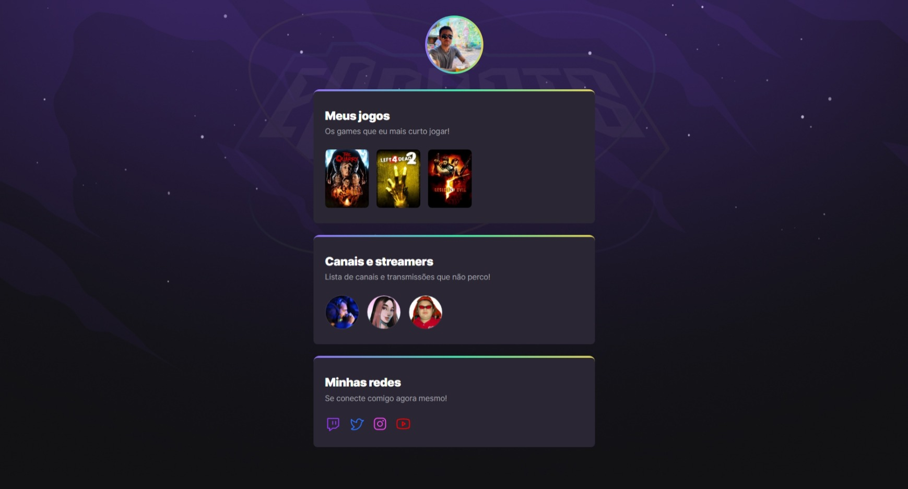

<h1>🚀 Projeto</h1>
<dd>Projeto de site com temática gamer, criado durante o evento NLW eSports trilha Explorer, promovido pela escola para formação de desenvolvedores RocketSeat.</dd>
 

  

<h1>🛠️ Tecnologias utilizadas</h1>
<ul>
    <li>Html</li>
    <li>CSS</li>
    <li>CSS Animations</li>
</ul>
  

<h1>📃 Como utilizar</h1>

Clique <a target="_blank" href="https://felipeteixeirams.github.io/nlw-esports-explorer/">aqui</a> para visualizar.

  

<h1>✨ Layout</h1>

Criado por: <a url="https://www.figma.com/file/xAIZZ4prYP4C5cuO2Cj4Uo/NLW-eSports-(Community)" target="_blank">RocketSeat</a>.

  

<h1>📃 Licença</h1>

Este projeto está sob licença do MIT. Consulte o arquivo <a url="">LICENSE</a> para obter mais detalhes.

 

<h3>Feito com ❤️ por <a url="https://www.instagram.com/felipeetex" target="_blank">Felipe Teixeira</a>.</h3>
